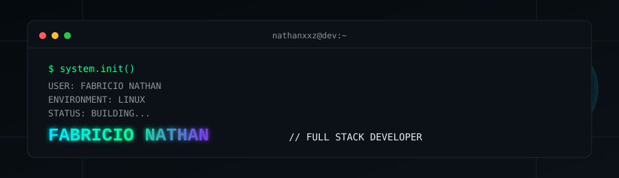

<div align="center">



<br/>

<a href="https://github.com/nathanxxz">
  
</a>

<br/><br/>


</div>

<br/>

## `$ whoami`

I'm **Fabricio Nathan**, a Full Stack Developer and Computer Science student (5th period), with about **2 years** in the field. I like understanding systems end-to-end — not just implementing screens, but knowing why they're built the way they are.

Right now I'm the Front-End developer on an **access control system** built for my university, integrated with **Control iD** hardware — a system that is actually in use on campus, not a class exercise. Alongside that, I'm expanding into **Software Architecture**, **Flutter/Dart** for mobile, and **AI-augmented development** workflows.

My path so far looks roughly like this:

```
UX/UI → Front-End → APIs → Backend → Database → Infrastructure → Architecture → AI
```

<br/>

## `$ current_focus`

```bash
$ current_focus --list

→ Software Architecture        (studying & applying)
→ Full Stack Development       (React, Java/Spring Boot)
→ Flutter & Dart               (mobile, in progress)
→ AI Agents & Agent Skills     (AI-augmented workflows)
→ System Design

$ environment
Linux

$ status
Building...
```

<br/>

## `$ experience --timeline`

### `01.` Front-End Developer — Access Control System (Control iD)
`React` `Vite` `Micro Front-End` `UX/UI` `API Integration` `Hardware Integration`

Built the front-end for an access control system integrated with Control iD hardware, using a Micro Front-End architecture. Responsible for interface design, API consumption, and the software↔hardware integration layer.

> **This system is currently in real use at my university** — not a prototype or academic exercise.

---

### `02.` Design Management — University Extension Project
`UX/UI` `Design Management` `Team Collaboration` `Integrated Systems`

Led the design side of an extension project applying **smart sensors to the Caatinga**, working on the interaction layer between users and connected devices.

---

### `03.` Academic Monitor — POO & Algorithms
`2025.1` `Object-Oriented Programming` `Algorithms`
`2025.2` `Object-Oriented Programming`

Supported fellow students in Object-Oriented Programming and Algorithms courses — reinforcing fundamentals while developing the ability to explain technical concepts clearly.

<br/>

## `$ featured_project`

### 🌎 Natural Disaster Risk Analysis
`Python` `Flask` `AI/ML exploration`

A project focused on analyzing and helping predict natural disaster risks, built with Python and Flask. **Selected to represent coursework at a university event**, it reflects my early exploration of applying software and AI/ML concepts to real-world problems.

<br/>

## `$ tech_stack`

**Languages**


**Front-End**


**Back-End & Architecture**


**Mobile** *(currently exploring)*


**Databases & Data**


**DevOps & Deploy**


**API Development & Testing**


**Design**


**Development Tools**


**AI / AI-Augmented Development**


<sub>Using **Bruno** for API development & testing — not Postman. Performance/load testing with **Apache JMeter**.</sub>

<br/>

## `$ github_analytics`

<div align="center">


<br/>


<br/>


<br/>


</div>

<sub>Snake animation generated automatically via `.github/workflows/snake.yml` — see PARTE 6 / repo setup.</sub>

<br/>

## `$ connect`

<div align="center">

[](https://github.com/nathanxxz)
[]([LINKEDIN_URL])
[]([PORTFOLIO_URL])
[](mailto:[EMAIL])

</div>

<br/>

<div align="center">
<sub>DESIGN → BUILD → INTEGRATE → TEST → ARCHITECT → AUTOMATE → EVOLVE</sub>
</div>
# nathanxxz
